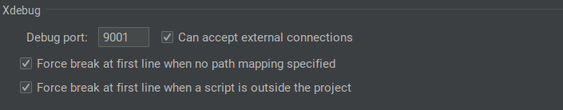
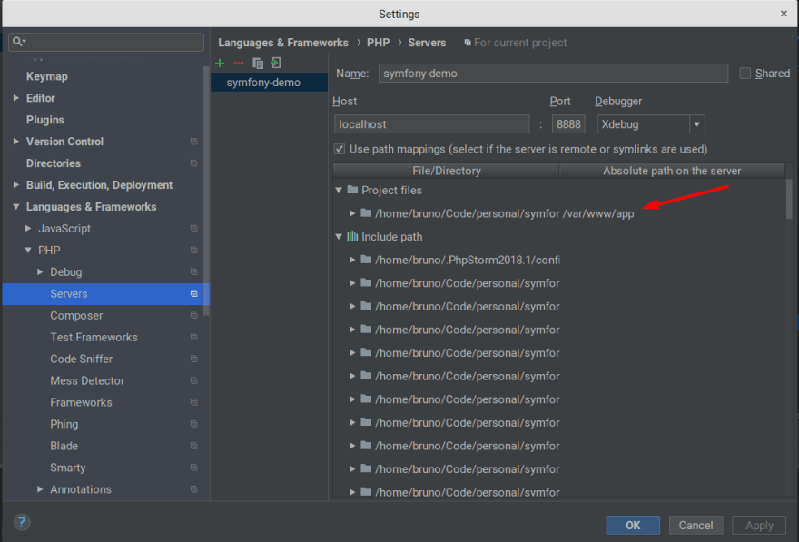

[](LICENSE.md)
[](https://scrutinizer-ci.com/g/shahrokhnabavi/nari-cms-api/build-status/master)
[](https://scrutinizer-ci.com/g/shahrokhnabavi/nari-cms-api/?branch=master)
[](https://scrutinizer-ci.com/code-intelligence)
[](https://scrutinizer-ci.com/g/shahrokhnabavi/nari-cms-api/?branch=master)

# Nari CMS api
Nari CMS api center, all api endpoints to manage content managment system are collected here

## xDebug
It will guide you to step by step through the process of installing and configuring
Xdebug and PHPStorm with a Dockerized php-fpm application. [xDebug documentation](https://xdebug.org/docs/install)

- Make sure xDebug is installed on PHP docker container
- xDebug setting (xdebug.ini) on php container should be as follow:
```ini
zend_extension=xdebug.so
xdebug.remote_enable=1
xdebug.remote_autostart=0
xdebug.remote_port=9000
xdebug.remote_host=docker.for.mac.localhost
xdebug.remote_log=/var/www/html/docker/data/xdebug.log
xdebug.remote_connect_back=0
```
- Install Xdebug helper extension for chrome
- The first thing you should do is to check your Debug settings.
In PHPStorm, go to File -> Settings -> Languages and Frameworks -> PHP > Debug.

- Next, we need to configure a server. This is how PHPStorm will map the file paths in your
local system to the ones in your container. Go to File -> Settings -> Languages and Frameworks -> PHP -> Servers


## API Request Body Validator
We received structured JSON data via each api call and validated them based on **JSON Schema**,
[JSON Schema](https://json-schema.org/) is a powerful tool for validating the structure of JSON data.
